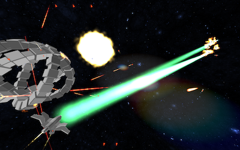

# Yet Another Space Shooter

It's yet another space shooter, but implemented in 13kb of (compressed) JavaScript.

## I JUST WANT TO PLAY

You'll have to come back. This will be set up later.

### I want to see developer mode

From the main repository view the file [src/webgl.html](src/webgl.html) from your browser.

This file additionally displays the frame rate and some statistics on how many frames took longer than 16ms to render.

## BUILDING

If you actually want to be able to build the small 13k version of the code and run it in this small version, there are a few more steps.

You'll want to run `python3 make.py`.

This will generate a few files, most importantly `build/index.html` which will run the game from there.

The additional files it outputs are also in build/, and consists of javascript files compressed with varying sophistication of techniques.

## LICENSE

This program is free software: you can redistribute it and/or modify it under the terms of the GNU General Public License as published by the Free Software Foundation, version 3.

This program is distributed in the hope that it will be useful, but WITHOUT ANY WARRANTY; without even the implied warranty of MERCHANTABILITY or FITNESS FOR A PARTICULAR PURPOSE. See the GNU General Public License for more details.

You should have received a copy of the GNU General Public License along with this program. If not, see http://www.gnu.org/licenses/.

